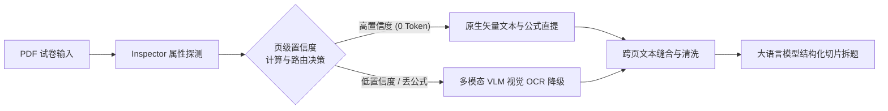
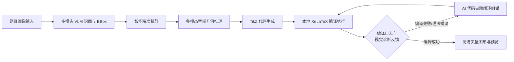

# MathBank - 本地化数学题库与组卷排版工作台

[中文](README.md) | [English](README_EN.md)

> **项目标签**：数学题库 | 高中数学 | 备课教研 | A4 仿真排版 | 智能组卷 | 高考级导出 | OCR 识图 | DeepSeek AI | 教育技术

**MathBank** 是一个专为中学数学教师打造的、完全运行在您自己电脑上的轻量级半自动化数学题库与组卷排版工作台。

无需复杂的前端编译即可运行：Windows 10/11 x64 便携包内置 Python 与匹配的 VC++ 运行库，解压后即可启动；macOS 便携包不内置 Python，运行前请确认本机已安装 Python 3.10 或更高版本，启动器会自动检测并创建或修复项目隔离的 `venv`。支持数学公式与几何图形秒级预览，深度集成一键组卷、A4 仿真画布排版、高考级 PDF 试卷导出、DeepSeek AI 解题以及一键 OCR 题目识别。


---

## ✨ 核心亮点

只需了解一些基础的 LaTeX 数学公式语法，MathBank 就能帮一线数学老师高效解决组卷与备课难题：

- 🎨 **1:1 A4 仿真组卷排版**：提供像 Word 一样直观的仿真试卷画布，密封线、大标题、注意事项框一应俱全。支持拖拽排序、题目留白高度调整，以及一键切换 A3 答题卡与高考 19 题预设。
- ⚡ **秒级公式渲染与高考级导出**：内置专业数学公式排版引擎，网页上修改秒级实时预览。支持一键导出高考标准的高清 PDF 试卷与完整的排版源码包。
- 🤖 **AI 智能组卷与辅助解答**：内置 DeepSeek 等大语言模型，能根据考点细目表与难度阶梯一键自动挑选题目生成试卷；支持单题一键 AI 生成详细解析与教学反思。
- 📄 **多格式试卷智能拆解与 PDF 双策略分流**：支持直接拖入 **LaTeX 源码 (.tex)**、**PDF 试卷 (.pdf)** 或 **Word 试卷 (.docx)** 快速智能切片拆题。PDF 拆解原生提供 **【原生文字公式提取】（默认推荐）** 与 **【全图视觉 OCR】** 双解析策略：推荐优先使用原生提取模式，享受 `PDF Inspector` 毫秒级 0 视觉 Token 损耗的极速提取，当遇到 Word/MathType 特殊导出卷导致公式硬转化为图片时，系统会自动平滑降级并触发 VLM 视觉 OCR 识图补全；同时，为避免极少数排版极其特殊的试卷使自愈规则失效，系统亦保留了全图视觉 OCR 的强力备选通道，保障 100% 拆解成功率。Word 导入则会结构化转换 Office OMML，并从 OLE `Equation Native` 流解析 MathType 结构，不能高置信转换的公式保留原预览图并标记人工核对。

---

## 🤖 AI Agent / Harness 工作流

系统内置了多套高度自动化、容错与自愈的 AI Agent / Harness 工作流，保障试卷拆解、几何绘图与并发解题的高可靠性：

### 1. PDF 试卷智能解析 (PDF Parsing Harness)


### 2. 几何图形重构与闭环自愈 (Geometry Reconstruction Harness)


### 3. 试卷切片与并发解题管道 (Paper Ingestion Harness)


---

## 📝 使用前提与环境说明

- **LaTeX 本地编译环境依赖**：只有当您需要使用 **TikZ 几何图形重绘** 或 **一键导出高清 PDF 试卷** 这两项功能时，系统才需要调用本地的 LaTeX 编译工具链。如果您仅进行题目录入、公式预览、题库检索、AI 智能解答与排版源码导出，**完全不需要安装 LaTeX**。若需使用上述两项功能，建议您在本地安装：
  * **macOS 用户**：推荐安装 [**MacTeX 官网**](https://www.tug.org/mactex/)（安装包约 5GB，国内推荐使用 [清华大学镜像站](https://mirrors.tuna.tsinghua.edu.cn/CTAN/systems/mac/mactex/) 极速下载）
  * **Windows 用户**：推荐安装 [**TeX Live 官网**](https://www.tug.org/texlive/)（ISO 镜像约 5GB，国内推荐使用 [清华大学镜像站](https://mirrors.tuna.tsinghua.edu.cn/CTAN/systems/texlive/Images/) 极速下载；也可选择 MiKTeX）
- **📄 Word (.docx) 试卷安全导入**：无需安装 Microsoft Word 或 MathType。系统可转换常见 OMML 公式，并使用 `olefile` + MTEF v5 记录树解析 MathType 结构；普通 `32`、拉丁 `p` 等不会再因旧的字符规则被误判。系统还会递归保留超链接/修订文字/Symbol 字符并提取表格与原图，不能高置信转换的公式则保留 Word 预览图。拆卷报告会分别显示结构转换、内嵌 LaTeX、有限兼容及人工核对数量。
- **📝 Word 可编辑公式导出**：系统会优先复用电脑上已安装的 Pandoc。首次导出时如未检测到，经用户确认后自动下载并安装到 MathBank 本地运行目录，安装完成后自动继续原导出；无需管理员权限、手动选路径或配置 PATH。下载优先使用 Pandoc 官方 GitHub Release，失败时自动切换 SourceForge 备用线路，两条线路均使用同一固定 SHA-256 校验。

---

## 🚀 快速开始

### 📦 方式一：下载便携包（非技术/小白用户首选）

如果您不熟悉命令行或 Python 环境，可以直接前往 [**Releases 页面**](https://github.com/JudgePeach/math-question-bank/releases) 下载官方构建包。发布页同时提供 `.zip.sha256` 校验文件，建议核对后再解压：

* **Windows 用户**：使用 Windows 10/11 x64，下载 `MathBank-Windows-x64.zip`（内含完整 Python 3.10 与应用本地 VC++ 运行时，无需另行安装），解压后双击运行 **`启动题库系统.bat`**
* **macOS 用户**：下载 `MathBank-macOS.zip`。**macOS 包不内置 Python，运行前请确认本机已安装 Python 3.10 或更高版本**。启动器会自动检测可用 Python，并自动创建或修复项目隔离的 `venv`；如未检测到合格版本，将提示安装并停止启动。首次创建或修复环境时需要联网，然后双击 **`启动题库系统.command`**

两个启动器只会停止由当前项目记录且身份校验通过的旧服务；若端口 8000 被其他程序占用，会安全退出。服务健康检查失败时不会打开浏览器。

---

### 💻 方式二：源码运行

1. **克隆项目**：
   ```bash
   git clone https://github.com/JudgePeach/math-question-bank.git
   cd math-question-bank
   ```

2. **创建并安装依赖**（要求 Python 3.10+；macOS/Homebrew Python 请使用项目虚拟环境）：
   ```bash
   python3 -m venv venv
   source venv/bin/activate
   python -m pip install -r requirements.txt
   ```
   参与开发或运行测试时，改用 `python -m pip install -r requirements-dev.txt`。依赖版本已锁定，升级时请同步运行测试与 `python -m pip check`。

3. **启动项目**：
   * **Mac 用户**：双击 **`启动题库系统.command`**
   * **Windows 用户**：双击 **`启动题库系统.bat`**
   * **命令行启动**：运行 `python -m uvicorn main:app --reload`，浏览器访问 `http://127.0.0.1:8000`

> [!TIP]
> **PDF & Word 试卷智能拆解建议**：
> 1. **PDF 策略选型**：导入 PDF 试卷时，建议保持默认选中的**【原生文字公式提取】**模式，享受毫秒级 0 视觉 Token 损耗极速切片；若遇到图片公式导致丢公式系统会自动触发 VLM OCR 补全；遇排版极其特殊的扫描卷可手动切换为**【全图视觉 OCR】**模式。
> 2. **试卷内容建议（避免超出 Token 限制）**：无论导入 **PDF 试卷** 还是 **Word (.docx) 试卷**，为防止试卷过长超出大模型单次 Context Window / Token 窗口上限，强烈建议优先选用**仅含题干（无冗长详细解析）**的试卷进行切片拆分。

---

## 🔑 API 配置与大模型选型指南

无论是使用源码还是便携包，AI 智能解析与 OCR 公式识别均依赖外部 API。启动项目后，点击网页右上角的 **设置（齿轮）按钮** 即可一键填入并保存密钥：

### 1. 🤖 纯文本 AI 推理大模型（解题/拆卷/分类）
推荐直接使用 [DeepSeek 官方开放平台](https://platform.deepseek.com/) 密钥，性价比与逻辑推导极高。

### 2. 📷 默认公式识图模型（OCR - 必须使用多模态 VLM 大模型）
* **必须使用多模态大模型**：公式识图需要读取图像，因此 **DeepSeek 纯语言模型无法用于 OCR 识图**。
* **国内模型选型**：推荐使用 **通义千问 (Qwen-VL)** 或 **MIMO** 系列。例如通过 [硅基流动 (SiliconFlow) 专属链接](https://cloud.siliconflow.cn/i/hkgjSWrg) 注册并完成实名认证后，可直接获得 **16 元代金券** 试用赠额；或者前往 [阿里云百炼平台](https://bailian.console.aliyun.com/) 注册，旗下的多模态模型在 **3 个月内均提供免费试用额度**。硅基流动可使用 `Qwen/Qwen3-VL-8B-Instruct`；阿里百炼常规 OCR、拆卷和分类推荐 `qwen3.7-flash`，解答与绘图推荐 `qwen3.7-plus`。
* **海外/中转站模型**：如果有合适的中转站或者其他渠道，**强烈推荐选择 `GPT-5.6 Luna`**！GPT 5.6 Luna 最近大幅降价，不仅在公式提取与精度上远超大多数模型，**使用成本甚至比千问还要便宜**，是识图的首选。

### 3. 🎨 TikZ 几何绘图模型（`PREFER_DRAW_MODEL`）
* 如果开启了双阶段多模态几何插图重绘，**建议不要使用国内模型**（目前国内模型在 TikZ 几何代码生成上表现普遍较差）。
* 建议选择 **GPT 系列**（如 `GPT-5.6 Luna`）或 **Gemini 系列**（如 `Gemini 3.6 Flash`），绘图精准度与矢量还原度极高。

> [!WARNING]
> **关于第三方 API 中转站的风险与担保声明**
> 
> 下面提供的两个中转站链接**仅因为开发者个人日常在用，不对其服务稳定性、模型真实度（是否存在掺水/以次充好）或数据隐私安全性提供任何形式的担保**。第三方中转站可能存在数据泄露、隐私风险或模型替换行为，请用户务必谨慎评估与使用：
> * **推荐多模态中转站 A (适合 GPT 模型)**：通过专属 [RightCodes 注册链接](https://www.rightapi.ai/register?aff=f7656b31) 获取 API Key，提供价格实惠且性能优越的 `gpt-5.6-luna` 系列。
> * **推荐多模态中转站 B (适合 Claude / 阿里系模型)**：通过专属 [PackyAPI 注册链接](https://www.packyapi.com/register?aff=5yyF) 获取 API Key，适合 Claude及阿里百炼模型。

> [!IMPORTANT]
> **关于 TikZ 自动几何重绘与本地 LaTeX 编译环境依赖**
> 
> 系统的 AI 智能几何插图 TikZ 重绘和 PDF 试卷编译渲染功能，高度依赖您**本地已安装的 LaTeX 编译排版环境**（如 macOS 下的 **MacTeX**，Windows 下的 **TeX Live** 或 **MiKTeX**）。
> 请确保安装后，您本地的命令行中能正常调用 `pdflatex` 与 `xelatex` 命令（即已正确将 LaTeX 工具链加入系统的环境变量 `PATH`）。如果本地未安装，AI 生成的 TikZ 源码和试卷 LaTeX 源码依旧能够完好保存与导出，但后台编译 PDF 将受到限制。

## 🔄 版本升级与数据备份

### 升级方式

- **✨ 界面一键检查更新与便携包直链**：系统内置自动版本检测机制。进入网页右上角【设置】$\rightarrow$【版本更新】，即可一键实时比对 GitHub 官方 Release，查阅最新版本特性并一键下载对应系统的便携包；亦支持一键忽略不常更新的版本。
- **方式 A：Git 升级（源码用户推荐）**
  ```bash
  git pull
  ```
  *说明：数据库 (`*.db`)、API 密钥 (`.env`)、维度配置 (`data_backup/`) 及插图 (`static/uploads/`) 均已被 Git 忽略，执行 `git pull` 绝不会影响本地数据。*

- **方式 B：便携包覆盖更新**
  1. 先创建一份可验证完整备份（见下方“完整备份与恢复”）。
  2. 在网页右上角点击电源按钮安全关闭题库，等待页面提示服务已停止；不要在后台运行时覆盖。
  3. 把新版 ZIP **解压到一个临时新目录**，不要直接解压进原目录。
  4. **Windows**：打开新版文件夹，全选其中的“内容”并复制到原项目目录，选择替换所有同名文件。
  5. **macOS Finder**：先按 `Command + Shift + .` 显示 `.env.example` 等隐藏文件，再复制新版文件夹里的全部“内容”到原目录并合并同名目录；**不要选择“替换整个文件夹”**，否则 Finder 可能先删除原目录中的本地数据。
  6. 双击新版启动器。启动器会在导入项目依赖前校验 Release 文件，并仅清理“上一版发布包管理且新版已删除”的旧文件；校验失败时会拒绝启动，请重新完整合并覆盖。

  覆盖升级会保留根目录数据库及 WAL/SHM、`.env`、`data_backup/`、`static/uploads/`、`.system_generated/` 和 `venv/`。请勿删除原项目目录再换成新目录。Windows 10/11 x64 便携包内置完整 Python 与 VC++ 运行时，无需另行安装；macOS 包不内置 Python，运行前请确认本机已安装 Python 3.10 或更高版本。macOS 启动器会自动创建或修复 `venv`，仅在首次建立环境或 `requirements.txt` 变化/依赖缺失时需要联网安装。

> [!IMPORTANT]
> **数据备份建议**
> 
> 完整备份是覆盖升级的首选保险。如需额外手动备份，请备份以下重要文件/目录：
> - `*.db` (本地题目数据库)
> - `.env` (API 密钥配置)
> - `data_backup/` (自定义题型与难度维度配置)
> - `static/uploads/` (已上传的插图与几何图形)

---

## 🛠️ 命令行检索与实用脚本

### 1. 本地终端极速检索 (`scripts/search_questions.py`)
在终端中快速检索题库（如搜索“导数”）：
```bash
python3 -m scripts.search_questions -q "导数"
```
**主要参数**：`-q` 关键词 | `-n` 返回数量 (默认 50, `-1` 无上限) | `-a` 携带答案解析 | `-t` 题型过滤 | `-d` 难度过滤 | `-r` 关联题目检索

### 2. 数据清洗与自愈脚本
- **填空题下划线全量升级**：`python3 -m scripts.migrate_fillin`（将旧下划线规范化为 `\fillin` 宏）
- **选择题题干空括号净化**：`python3 -m scripts.migrate_choice_parentheses`（自动抹除题干末尾空括号，防止与 `\paren` 重叠）
- **构建跨平台 Release**：先确认 `mathbank/__init__.py` 的版本号，再运行 `python3 -m scripts.build_release`。构建器会校验固定 SHA-256 的官方 Python/NuGet 运行时、Release 白名单、运行时布局与源码 smoke，并生成包内 `RELEASE-MANIFEST.json` 和包外 `.zip.sha256`。

### 3. 完整备份与恢复

```bash
# 创建数据库 + 上传图片 + 自定义元数据的可验证完整备份
python3 -m scripts.backup

# 只校验备份，不改动当前数据
python3 -m scripts.restore data_backup/snapshots/mathbank-backup-时间戳.zip

# 实际恢复：必须先完全关闭题库服务
python3 -m scripts.restore data_backup/snapshots/mathbank-backup-时间戳.zip --apply --yes
```

完整备份含逐文件 SHA-256 清单，不包含 `.env`、本地 Token 或 API 密钥。服务与恢复工具共用跨平台运行锁，服务未完全关闭时恢复会拒绝执行。`questions_backup.json` 只是兼容检索与同步的 JSON 导出，不能代替完整备份。

---

## 📂 项目目录结构

```text
.
├── data_backup/                # 实时备份与 AI 专属只读题库 (已忽略)
│   ├── archive/                # 历史迁移与测试数据库归档
│   ├── snapshots/              # 带清单与哈希校验的完整恢复包
│   ├── schema_snapshots/       # 数据库迁移前独立快照及 SHA-256
│   ├── questions_backup.json   # 题目 JSON 同步导出（非完整恢复包）
│   └── questions_library.md    # AI 专属只读题库（过滤答案，防 AI 泄露）
├── docs/                       # 项目文档与 README 展示图片
│   ├── AI_DATABASE_GUIDE.md    # AI 题库检索使用指南
│   ├── 项目目录重构与模块解耦整理计划.md
│   └── images/                 # 产品界面预览图
├── mathbank/                   # 后端业务领域包
│   ├── database.py             # SQLite 数据模型与 Session
│   ├── db_migrations.py        # 版本化、备份优先的 SQLite 迁移
│   ├── backup.py               # 完整备份、验证、恢复与回滚
│   ├── asset_security.py       # 上传验证与本地资产路径安全边界
│   ├── task_manager.py         # 有界异步任务、取消与资源生命周期
│   ├── health.py               # 启动就绪与数据库健康检查
│   ├── paper_helper.py         # LaTeX/PDF 编译、排版与 LRU 缓存
│   ├── sync_helper.py          # JSON 同步导出与 AI 题库清洗
│   ├── paths.py                # 与工作目录无关的项目路径单一来源
│   ├── metadata.py             # 题型与难度默认元数据
│   ├── prompts.py              # OCR/解题/拆卷/TikZ/组卷提示构建器
│   ├── ai_providers.py         # AI Provider 与模型参数解析
│   ├── ai_http.py              # AI HTTP 请求与鉴权
│   ├── ai_json.py              # AI 结构化 JSON 容错解析
│   ├── latex_diagnostics.py    # XeLaTeX 错误定位、本地解释与 AI 诊断合并
│   ├── content_locks.py        # Word 公式原位可见锁定、原文恢复与完整性校验
│   ├── omml_helper.py          # Office OMML 结构化公式转换器
│   ├── mtef_helper.py          # MathType OLE/MTEF v5 结构解析与失败诊断
│   ├── docx_helper.py          # Word 文字/表格/图片安全提取与诊断报告
│   ├── pdf_inspector_helper.py # PDF Inspector 原生矢量直提与双轨探测
├── scripts/                    # 运维、迁移、检索与 Release 工具
│   ├── search_questions.py
│   ├── backup.py
│   ├── restore.py
│   ├── migrate_fillin.py
│   ├── migrate_choice_parentheses.py
│   └── build_release.py
├── static/                     # 前端静态资源目录
│   ├── index.html              # 主控制台前端页面 (SPA)
│   ├── css/                    # Tailwind, FontAwesome, KaTeX 离线样式
│   ├── uploads/                # 插图存储目录 (自动物理清理)
│   └── js/                     # 级联加载前端 JS 模块
│       ├── api.js              # API 交互与 Token 拦截
│       ├── editor.js           # 编辑、KaTeX 预览与 TikZ 编译
│       ├── ocr.js              # OCR 公式识别与交互
│       ├── import.js           # 试题拆解与草稿/题库列表
│       └── paper.js            # 组卷排版工作台 & Live Preview 渲染引擎
├── templates/                  # LaTeX 试卷模板与 exam-zh 宏包库
├── tests/                      # Pytest 自动化测试与 artifacts
├── main.py                     # FastAPI 服务主入口与路由逻辑
├── math_question_bank.db       # 本地 SQLite 主数据库（根目录兼容保留）
├── 启动题库系统.bat            # Windows 一键启动脚本
├── 启动题库系统.command        # macOS 一键启动脚本
├── README.md                   # 中文说明文档
├── README_EN.md                # 英文说明文档
├── requirements.txt            # Python 依赖包清单
├── requirements-dev.txt        # 开发与测试依赖
└── .env.example                # 环境变量配置模板
```

---

## 📄 开源协议

本项目采用 [GNU AGPLv3](LICENSE) 协议开源。

---

## 💬 QQ 用户交流群

欢迎加入 MathBank 用户交流群，群号：`1107557945`。

<p align="center">
  
</p>
