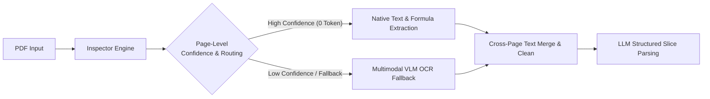
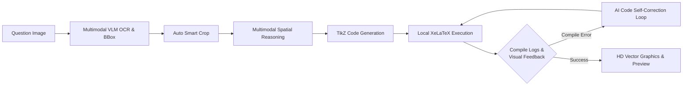
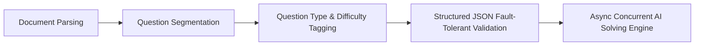

# MathBank - Localized Math Question Bank & Exam Layout Workbench

[中文](README.md) | [English](README_EN.md)

> **Project Tags**: Math Question Bank | High School Math | Lesson Prep & Teaching Research | A4 Layout Simulation | Intelligent Exam Generation | Gaokao-Level Export | Formula OCR | DeepSeek AI | EdTech

**MathBank** is a lightweight, semi-automated math question bank and exam paper layout workbench running entirely on your local computer, tailored specifically for secondary school mathematics teachers.

No frontend build step is required. The Windows 10/11 x64 portable package includes Python and its matching app-local VC++ Runtime and runs after extraction. The macOS package does not include Python, so confirm that Python 3.10 or newer is installed on the Mac before launching it; the launcher automatically detects it and creates or repairs the isolated project `venv`. MathBank supports second-level real-time preview of LaTeX formulas and geometric figures, deeply integrated with one-click exam paper creation, A4 simulation canvas layout, Gaokao-level PDF exam paper export, DeepSeek AI problem solving, and one-click formula OCR recognition.


---

## ✨ Key Highlights

With just basic LaTeX math formula syntax, MathBank empowers frontline math teachers to efficiently solve exam generation and lesson preparation challenges:

- 🎨 **1:1 A4 Simulation Exam Layout**: Provides an intuitive exam paper canvas just like Word, complete with sealing line, title, and notice box. Supports drag-and-drop sorting, question blank space height adjustment, and one-click switching to A3 answer sheet or Gaokao 19-question preset.
- ⚡ **Second-Level Formula Rendering & Exam-Level Export**: Built-in professional math formula typesetting engine with real-time web preview. Supports one-click export of high-definition PDFs matching National College Entrance Examination (Gaokao) standards and complete LaTeX source packages.
- 🤖 **AI Intelligent Exam Generation & Solving Assistance**: Built-in Large Language Models (DeepSeek, etc.) automatically select questions and generate exams based on knowledge point breakdown tables and difficulty gradients; supports single-question AI generation of detailed solutions and teaching reflections.
- 📄 **Multi-Format Exam Smart Parsing & PDF Dual-Strategy Route**: Supports direct drag-and-drop of **LaTeX source (.tex)**, **PDF exams (.pdf)**, or **Word documents (.docx)** for fast intelligent slice parsing. PDF parsing natively offers dual strategies: **[Native Vector Text & Formula Extraction] (Default Recommended)** and **[Full-Page Visual OCR]**. Primary recommendation is native extraction using `PDF Inspector` for sub-second, 0-visual-token loss extraction; if images cause missing formulas, the system smoothly falls back to VLM visual OCR completion; a full-page visual OCR channel is also available as a reliable fallback for unusually formatted exams, ensuring 100% breakdown success rate. Word import structurally converts Office OMML and parses MathType structures from OLE `Equation Native` streams, preserving preview images with manual audit tags for non-high-confidence formulas.

---

## 🤖 AI Agent / Harness Workflows

MathBank features multiple highly automated, fault-tolerant, and self-healing AI Agent / Harness workflows to ensure high reliability across exam parsing, geometry redrawing, and concurrent solving:

### 1. PDF Parsing Harness


### 2. Geometry Reconstruction & Self-Correction Harness


### 3. Paper Ingestion & Concurrent Solving Harness


---

## 📝 Prerequisites & Environment Setup

- **LaTeX Local Compilation Environment Dependency**: Required ONLY if you need **TikZ geometry diagram redrawing** or **one-click HD PDF export**. If you only perform question entry, formula preview, searching, AI solving, and layout source package export, **no LaTeX installation is required**. If needed:
  * **macOS users**: Recommend installing [**MacTeX Official Website**](https://www.tug.org/mactex/) (Package ~5GB; Tsinghua University mirror recommended for fast download in China).
  * **Windows users**: Recommend installing [**TeX Live Official Website**](https://www.tug.org/texlive/) (ISO ~5GB; Tsinghua University mirror recommended; MiKTeX is also supported).
- **📄 Word (.docx) Exam Paper Safe Import**: No Microsoft Word or MathType installation needed. The system converts standard OMML formulas and uses `olefile` + MTEF v5 record trees to parse MathType structures; numbers like `32` and Latin letters like `p` won't be misidentified by legacy character rules. The system recursively preserves hyperlinks, tracked revisions, and Symbol characters, while extracting tables and original images. Preview images are kept for formulas without high-confidence conversion. The parser report details counts for structural conversion, embedded LaTeX, limited compatibility, and manual review needed.

---

## 🚀 Quick Start

### 📦 Option 1: Download Portable Package (Recommended for Non-Technical Users)

If you are unfamiliar with command line or Python environments, head to the [**Releases Page**](https://github.com/JudgePeach/math-question-bank/releases). Each archive is accompanied by a `.zip.sha256` checksum file; verify it before extraction:

* **Windows Users**: Use Windows 10/11 x64 and download `MathBank-Windows-x64.zip` (it includes the complete Python 3.10 and app-local VC++ runtimes; no separate runtime installation is required), extract it, and double-click **`启动题库系统.bat`**.
* **macOS Users**: Download `MathBank-macOS.zip`. **The macOS package does not include Python, so confirm that Python 3.10 or newer is installed on the Mac before launching MathBank.** The launcher automatically detects a supported Python and creates or repairs the isolated project `venv`; if none is found, it asks the user to install one and stops. Network access is required when the environment is first created or repaired; then double-click **`启动题库系统.command`**.

Both launchers stop only a previously recorded process whose project identity is verified. If another program owns port 8000 they exit safely, and they never open a browser after a failed health check.

---

### 💻 Option 2: Run from Source

1. **Clone Repository**:
   ```bash
   git clone https://github.com/JudgePeach/math-question-bank.git
   cd math-question-bank
   ```

2. **Create the virtual environment and install dependencies** (Python 3.10+ required; use the project environment with macOS/Homebrew Python):
   ```bash
   python3 -m venv venv
   source venv/bin/activate
   python -m pip install -r requirements.txt
   ```
   For development or tests, use `python -m pip install -r requirements-dev.txt`. Versions are locked; run the tests and `python -m pip check` when upgrading them.

3. **Launch Service**:
   * **Mac Users**: Double-click **`启动题库系统.command`**
   * **Windows Users**: Double-click **`启动题库系统.bat`**
   * **CLI Start**: Run `python -m uvicorn main:app --reload`, open browser at `http://127.0.0.1:8000`

> [!TIP]
> **PDF & Word Smart Parsing Recommendations**:
> 1. **PDF Strategy Selection**: Keep default **[Native Text & Formula Extraction]** mode when importing PDF exams for sub-second, 0-visual-token slice parsing; if image formulas cause missing items, VLM OCR auto-completes them; for heavily non-standard scanned documents, manually switch to **[Full-Page Visual OCR]** mode.
> 2. **Exam Content Recommendation (Avoid Token Limit Exceeded)**: For both **PDF** and **Word (.docx)** imports, to avoid exceeding LLM single Context Window / Token limits on extremely long exams, it is strongly recommended to prioritize exams with **questions only (no lengthy detailed solutions)**.

---

## 🔑 API Configuration & LLM Selection Guide

Whether running from source or portable packages, AI smart parsing and OCR formula recognition rely on external APIs. After launching, click the **Settings (Gear Icon)** button in the top right corner of the web interface to save API keys:

### 1. 🤖 Pure Text LLM Reasoning (Solving / Parsing / Classification)
Directly using [DeepSeek Official Open Platform](https://platform.deepseek.com/) API key is recommended for exceptional cost-performance and logical reasoning.

### 2. 📷 Default Formula OCR Model (Must use Multimodal VLM)
* **Must use Multimodal LLMs**: Formula OCR reads images, so **pure language models (like DeepSeek V3/R1 text-only) cannot be used for OCR**.
* **Domestic Model Options**: Recommend **Qwen-VL** or **MIMO** series. E.g., registering via [SiliconFlow Referral Link](https://cloud.siliconflow.cn/i/hkgjSWrg) grants a **¥16 voucher**; or register on [Aliyun Bailian Platform](https://bailian.console.aliyun.com/), which offers a **3-month free trial quota** for multimodal models. Use `Qwen/Qwen3-VL-8B-Instruct` on SiliconFlow; on Bailian, use `qwen3.7-flash` for routine OCR, paper parsing, and classification, or `qwen3.7-plus` for solving and TikZ drawing.
* **Overseas / Aggregator Providers**: If you have access to API relay platforms, **`GPT-5.6 Luna` is strongly recommended**! Recent price drops make GPT-5.6 Luna perform significantly better than most models in formula extraction accuracy while being **cheaper than Qwen**, making it the top choice for OCR.

### 3. 🎨 TikZ Geometry Diagram Redrawing Model (`PREFER_DRAW_MODEL`)
* If two-stage multimodal geometric illustration redrawing is enabled, **avoid using domestic models** (currently domestic models underperform on TikZ geometry code generation).
* Recommend **GPT series** (e.g., `GPT-5.6 Luna`) or **Gemini series** (e.g., `Gemini 3.6 Flash`), offering extremely high drawing accuracy and vector fidelity.

> [!WARNING]
> **Disclaimer Regarding Third-Party API Relay Services**
> 
> The two third-party API relay links provided below are listed **solely because the developer uses them personally in daily workflow, and no guarantees or warranties are made regarding their service stability, model authenticity (watered-down/replaced models), or data privacy/security**. Third-party aggregators may pose data leak, privacy, or model substitution risks. Use with caution:
> * **Recommended Multimodal Aggregator A (Ideal for GPT Models)**: Obtain API keys via [RightCodes Registration Link](https://www.rightapi.ai/register?aff=f7656b31), providing affordable and performant `gpt-5.6-luna` series.
> * **Recommended Multimodal Aggregator B (Ideal for Claude / Alibaba Models)**: Obtain API keys via [PackyAPI Registration Link](https://www.packyapi.com/register?aff=5yyF), suitable for Claude and Aliyun Bailian models.

> [!IMPORTANT]
> **Regarding TikZ Auto Geometry Redrawing & Local LaTeX Environment Dependency**
> 
> The AI intelligent TikZ geometry redrawing and PDF exam compilation/rendering features rely heavily on your **locally installed LaTeX typesetting environment** (such as **MacTeX** on macOS, **TeX Live** or **MiKTeX** on Windows).
> Make sure `pdflatex` and `xelatex` commands can be invoked from your terminal (i.e. LaTeX toolchain added to system `PATH`). If not installed locally, AI-generated TikZ code and LaTeX source code are still saved and exported intact, but background PDF compilation will be restricted.

## 🔄 Version Upgrade & Data Backup

### Upgrade Methods

- **✨ In-App One-Click Update Check & Portable Direct Link**: Built-in automatic version detection. Go to top-right 【Settings】$\rightarrow$【Version Updates】to compare against GitHub Releases, view release notes, and download portable packages directly, or ignore updates.
- **Method A: Git Upgrade (Recommended for Source Users)**
  ```bash
  git pull
  ```
  *Note: Databases (`*.db`), API keys (`.env`), dimension configurations (`data_backup/`), and illustrations (`static/uploads/`) are Git-ignored. `git pull` will never overwrite local data.*

- **Method B: Portable Package Overwrite Upgrade**
  1. Create a verified full backup first (see **Full Backup and Restore** below).
  2. Use the power button in the top-right of the web page to shut MathBank down safely, and wait until the page confirms that the service has stopped. Never overwrite files while the backend is running.
  3. Extract the new ZIP into a **separate temporary directory**, not directly into the existing installation.
  4. **Windows:** open the extracted folder, select all of its *contents*, copy them into the existing installation, and replace every same-named file when prompted.
  5. **macOS Finder:** press `Command + Shift + .` first so hidden files such as `.env.example` are visible, then copy all *contents* of the extracted folder into the existing installation and merge same-named directories. **Do not choose Replace for the entire project folder**; Finder may remove local files that exist only in the old folder.
  6. Double-click the new launcher. Before importing application dependencies, it verifies the Release and removes only files managed by the previous Release that no longer exist in the new one. If verification fails, startup stops; extract the ZIP again and repeat the complete content merge.

  Overlay upgrades preserve root databases and their WAL/SHM files, `.env`, `data_backup/`, `static/uploads/`, `.system_generated/`, and `venv/`. Never delete the existing installation and replace it with the new folder. The Windows 10/11 x64 portable package includes its complete Python and VC++ runtimes, so no separate runtime installation is required. The macOS package does not include Python, so confirm that Python 3.10 or newer is installed on the Mac before launching it. The macOS launcher automatically creates or repairs `venv`; network access is needed only when the environment is first created or when `requirements.txt` changed/dependencies are missing.

> [!IMPORTANT]
> **Data Backup Recommendation**
> 
> A verified full backup is the preferred safeguard before an overlay upgrade. For an additional manual copy, preserve these files/directories:
> - `*.db` (Local Question Database)
> - `.env` (API Key Config)
> - `data_backup/` (Custom Question Types & Difficulties)
> - `static/uploads/` (Uploaded Illustrations & Geometry Figures)

---

## 🛠️ CLI Search & Utility Scripts

### 1. Fast Local Terminal Search (`scripts/search_questions.py`)
Quickly search the question bank from terminal (e.g. search "derivative"):
```bash
python3 -m scripts.search_questions -q "导数"
```
**Parameters**: `-q` keyword | `-n` return count (default 50, `-1` unlimited) | `-a` include answers/solutions | `-t` filter type | `-d` filter difficulty | `-r` search associated questions

### 2. Data Cleaning & Self-Healing Scripts
- **Fill-in-the-blank Underline Upgrade**: `python3 -m scripts.migrate_fillin` (Standardizes old underlines to `\fillin` macro)
- **Multiple-Choice Empty Parentheses Cleanup**: `python3 -m scripts.migrate_choice_parentheses` (Cleans trailing empty parentheses in stems to avoid overlap with `\paren`)
- **Build Cross-Platform Release**: Confirm the version in `mathbank/__init__.py`, then run `python3 -m scripts.build_release`. The builder verifies pinned SHA-256 values for the official Python/NuGet runtimes, the Release allowlist, runtime layout, and a source smoke check. It emits an in-archive `RELEASE-MANIFEST.json` and an external `.zip.sha256` file.

### 3. Full Backup and Restore

```bash
# Create a verified backup of the database, uploads, and custom metadata
python3 -m scripts.backup

# Verify only; this does not modify current data
python3 -m scripts.restore data_backup/snapshots/mathbank-backup-TIMESTAMP.zip

# Restore for real: completely stop MathBank first
python3 -m scripts.restore data_backup/snapshots/mathbank-backup-TIMESTAMP.zip --apply --yes
```

Full backups include a per-file SHA-256 manifest and exclude `.env`, the local token, and API secrets. The server and restore tool share a cross-platform runtime lock, so restore refuses to run until the service is fully stopped. `questions_backup.json` is a compatibility JSON export for search/sync; it is not a disaster-recovery backup.

---

## 📂 Project Directory Structure

```text
.
├── data_backup/                # Real-time backup & AI read-only library (Git ignored)
│   ├── archive/                # Historical migrations & database archives
│   ├── snapshots/              # Verified full-recovery archives
│   ├── schema_snapshots/       # Standalone pre-migration snapshots and SHA-256
│   ├── questions_backup.json   # Question JSON sync export (not a full backup)
│   └── questions_library.md    # AI-exclusive read-only question bank (solutions filtered)
├── docs/                       # Project documentation & README preview images
│   ├── AI_DATABASE_GUIDE.md    # AI question bank search guide
│   ├── 项目目录重构与模块解耦整理计划.md
│   └── images/                 # Product interface preview screenshots
├── mathbank/                   # Backend domain package
│   ├── database.py             # SQLite data models & Session
│   ├── db_migrations.py        # Versioned, backup-first SQLite migrations
│   ├── backup.py               # Full backup, verification, restore & rollback
│   ├── asset_security.py       # Upload validation & local asset boundary
│   ├── task_manager.py         # Bounded tasks, cancellation & asset lifecycle
│   ├── health.py               # Startup readiness & database health
│   ├── paper_helper.py         # LaTeX/PDF compilation, layout & LRU cache
│   ├── sync_helper.py          # JSON sync export & AI library sanitizer
│   ├── paths.py                # Single source of truth for project paths
│   ├── metadata.py             # Default question type and difficulty metadata
│   ├── prompts.py              # Prompt builder for OCR/solve/parse/TikZ/paper
│   ├── ai_providers.py         # AI provider & model parameter parsers
│   ├── ai_http.py              # AI HTTP requests & authentication
│   ├── ai_json.py              # AI structured JSON fault-tolerant parser
│   ├── latex_diagnostics.py    # XeLaTeX error diagnosis & AI solver
│   ├── content_locks.py        # Word formula inline visible locking & verification
│   ├── omml_helper.py          # Office OMML structured formula converter
│   ├── mtef_helper.py          # MathType OLE/MTEF v5 parser & diagnostics
│   ├── docx_helper.py          # Word text/table/image extractor & report
│   ├── pdf_inspector_helper.py # PDF Inspector vector text extraction
├── scripts/                    # Maintenance, migration, search & release tools
│   ├── search_questions.py
│   ├── backup.py
│   ├── restore.py
│   ├── migrate_fillin.py
│   ├── migrate_choice_parentheses.py
│   └── build_release.py
├── static/                     # Frontend static assets
│   ├── index.html              # Main dashboard frontend SPA
│   ├── css/                    # Offline styles for Tailwind, FontAwesome, KaTeX
│   ├── uploads/                # Illustration uploads (auto-cleaned)
│   └── js/                     # Cascading frontend JS modules
│       ├── api.js              # API interaction & Token interceptor
│       ├── editor.js           # Editing, KaTeX preview & TikZ compilation
│       ├── ocr.js              # Formula OCR recognition & interaction
│       ├── import.js           # Exam paper parsing & draft/question list
│       └── paper.js            # Exam paper workbench & Live Preview engine
├── templates/                  # LaTeX templates & exam-zh macro package library
├── tests/                      # Pytest automated testing & artifacts
├── main.py                     # FastAPI service entry point & routing
├── math_question_bank.db       # Local SQLite database (retained for backward compatibility)
├── 启动题库系统.bat            # Windows one-click start script
├── 启动题库系统.command        # macOS one-click start script
├── README.md                   # Chinese documentation
├── README_EN.md                # English documentation
├── requirements.txt            # Python dependencies
├── requirements-dev.txt        # Development & testing dependencies
└── .env.example                # Environment variable configuration template
```

---

## 📄 Open Source License

This project is open-source under the [GNU AGPLv3](LICENSE) license.
